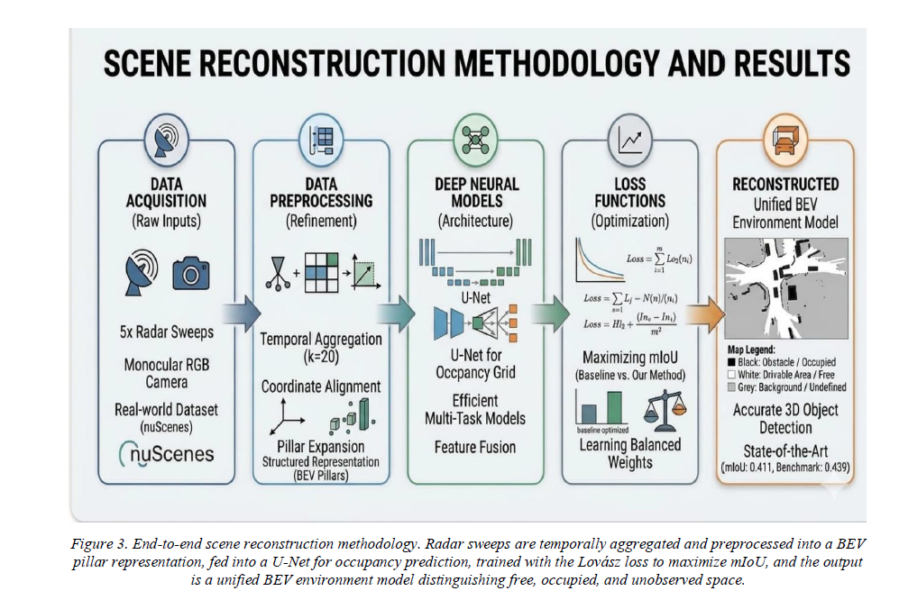
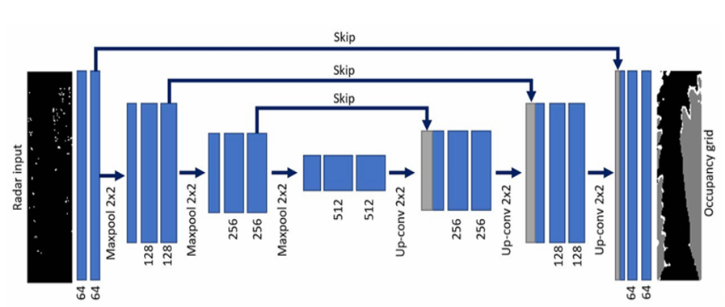
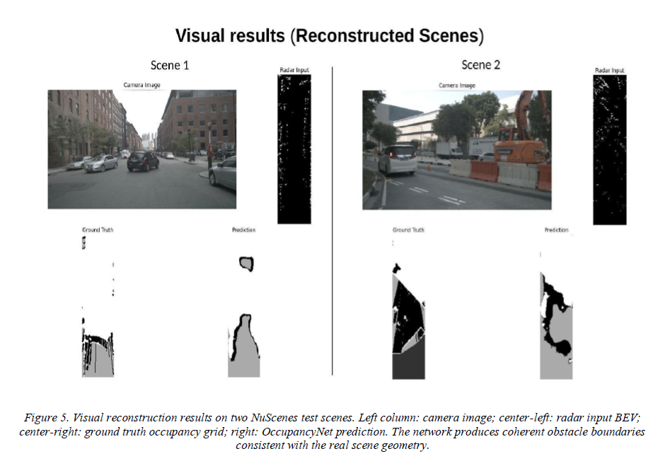

# Radar Occupancy Grid Learning for Autonomous Driving

PyTorch implementation of occupancy grid learning for autonomous driving using sparse radar clusters from the nuScenes dataset.

---

## Overview

This project implements a deep learning-based occupancy grid mapping system using sparse automotive radar data from the nuScenes autonomous driving dataset.

The model reconstructs road scenes in Bird’s Eye View (BEV) using a U-Net-based semantic segmentation architecture trained on LiDAR-derived occupancy labels.

---

## Features

- Radar-based occupancy grid mapping
- Bird’s Eye View (BEV) scene reconstruction
- Temporal radar aggregation
- LiDAR-based automatic ground truth generation
- U-Net semantic segmentation architecture
- Evaluation using IoU and mIoU metrics
- Visualization pipeline for occupancy prediction analysis

---

## Methodology



---

## Model Architecture



---

## Visual Reconstruction Results



---

## Results

| Method | mIoU |
|---|---|
| Ray Trace | 0.1744 |
| Delta ISM | 0.1902 |
| OccupancyNet (Ours) | **0.4993** |

---

## Tech Stack

- Python
- PyTorch
- OpenCV
- NumPy
- SciPy
- Matplotlib
- Scikit-image
- nuScenes Dataset
- Semantic Segmentation
- U-Net

---

## Repository Structure

```text
radar-occupancy-grid-mapping/
│
├── dataset.py          # NuScenes preprocessing and radar aggregation
├── model.py            # U-Net OccupancyNet implementation
├── train.py            # Training pipeline
├── evaluate.py         # IoU and mIoU evaluation
├── visualize.py        # Occupancy visualization
├── baselines.py        # Ray Trace and ISM baseline methods
├── losses.py           # Loss functions
├── requirements.txt
├── README.md
│
├── assets/             # Images and diagrams
├── outputs/            # Visualization outputs
├── report/             # Project report
│
└── .gitignore
```

---

## Setup

### 1. Clone Repository

```bash
git clone https://github.com/Zenith517/radar-occupancy-grid-mapping.git
cd radar-occupancy-grid-mapping
```

---

### 2. Create Virtual Environment

```bash
python -m venv venv
.\venv\Scripts\activate
```

---

### 3. Install Dependencies

```bash
pip install -r requirements.txt
```

---

## Dataset Setup

This project uses the nuScenes autonomous driving dataset.

Download the dataset from:

https://www.nuscenes.org/download

Place the dataset in:

```text
C:\Users\archi\project\nuscenes
```

Dataset files are not included in this repository due to size restrictions.

---

## Pretrained Checkpoints

Model checkpoints are not included in this repository due to file size limitations.

You can train the model using:

```bash
python train.py
```

---

## Running the Project

### Evaluate OccupancyNet

```bash
python evaluate.py --method model --checkpoint checkpoints/model_epoch_5.pth
```

---

### Generate Visualization Results

```bash
python visualize.py
```

Generated outputs will be stored in:

```text
outputs/
```

---

## Example Evaluation Results

```text
Evaluation Results:
Method         : model
----------------------------------------
IoU Free       : 0.0974
IoU Occupied   : 0.7494
IoU Unobserved : 0.6510
----------------------------------------
mIoU Total     : 0.4993
```

---

## Project Components

### dataset.py
Handles:
- Radar frame aggregation
- BEV occupancy grid creation
- LiDAR ground truth generation
- Camera image loading

---

### model.py
Implements:
- U-Net-based OccupancyNet architecture
- Multi-class semantic segmentation

---

### evaluate.py
Performs:
- IoU computation
- mIoU benchmarking
- Baseline comparisons

---

### visualize.py
Generates:
- Camera image visualization
- Radar occupancy maps
- Ground truth comparison
- Model prediction outputs

---

## Baseline Methods

The project compares OccupancyNet against classical approaches:

- Ray Tracing
- Delta ISM
- Gaussian ISM

---

## Applications

- Autonomous Driving
- Radar Perception
- Environment Mapping
- Driver Assistance Systems
- Scene Reconstruction

---

## Project Report

Detailed project report available in:

```text
report/project_report.pdf
```

---

## Acknowledgement

This project is based on collaborative work inspired by:

"Road Scene Understanding by Occupancy Grid Learning from Sparse Radar Clusters using Semantic Segmentation" (ICCVW 2019)

Contributors:
- Om Mishra
- Archit Vyas

---

## License

This project is intended for academic and research purposes.
